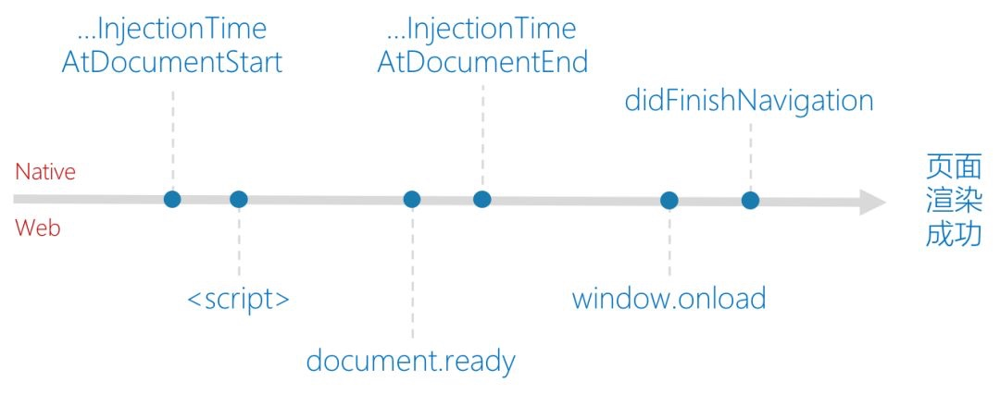
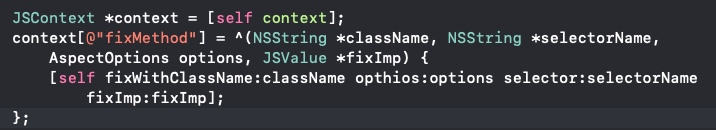
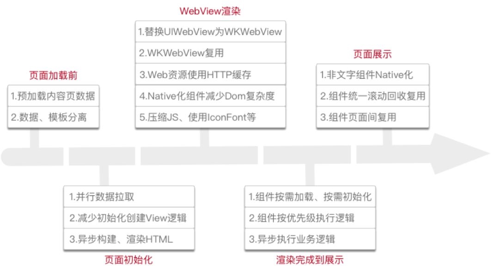

# WKWebview 缓存   iOS 9 SFSafariViewController
### WKKWebView


> 白屏主要原因：1.web进程crash 2.webview渲染出错。检测方案：iOS9之后对应白屏的回调函数；还有通过判断 url/title 是否为空；通过视图树对比（WKCompsitingView）

> cookie同步问题：APP共用一个ProcessPool 因为webkit 和 nshttpcookiestorage 不同步 如果存在request中需要手动添加到head中去

> 通讯方式：通过系统或私有方法获取当前webview当中的context，基于JSCore的函数通信；创建自定义Scheme的iframe Dom,在客户端进行拦截。

> 热更新 & 跨平台：context注册block回调，以及JSExport。context evaluate js + runtime (替换，执行前，执行后)
* 热更新

* 跨平台


> web优化：1.网络层：DNS/CDN技术减少网络延迟，通过各种HTTP缓存技术减少网络请求次数，通过资源压缩和合并减少请求内容；2.渲染层：精简和优化业务代码、按需加载、防止阻塞、调整加载顺序优化 3.web复用&预热 预热就是在APP启动是就创建一个webview 复用分两种 1>常驻一个空webview在内存 2>不销毁打开过的webview,直接缓存在内存
* 容器复用和预热
 
* webview整体优化流程



> Native并行资源请求 && 离线包 

> 本地serve访问资源公用, 减少网络资源请求, 减少离线包体积

> 资源动态更新和管理: 下载时机和重试；下载包签名校验；增量更新

> JavaScript Open Api: 注入方式、时机 1.本地js文件注入，2.在线js文件注入 CDN; 安全控制  api权限分级 通过配置白名单下发权限


### extension:
> 1.设置cookie 
```
NSString *cookieStr = @"doucument.cookie = 'name=111;domain=//;path=www.baidu.com;expiresDate:'+(new Date(%@).toUTCString());"
[webview evaluateJavaScript:cookieStr completionHandler:nil];
```
> 2.设置UserAgent
```
1.替换 
[[NSUserDefaults standardUserDefaults] registerDefaults:@{@"":@"UserAgent"}];
2.拼接
wkwebview: 
SEL ： @"_userAgent"
//获取当前UserAgent
[webview performSelector:SEL];
uiwebview: 注意iOS12 crash
[uiwebview stringByEvaluatingJavaScriptFromString:@"navigator.userAgent"];
```
> 3.设置页面 MenuItem
```
//通过获取私有方法  然后替换方法实现
class WKContentView
sel  canPerformAction:withSender:
class_replaceMethod
```
> 4.禁用页面双击
```
//通过获取私有方法 然后用runtime替换方法实现
class WKContentView
sel _nonBlockingDoubleTapRecognized:
class_replaceMethod
```
> 5.清除缓存
```
NSSet *websiteDataTypes = [NSSet setWithArray:@[
                                       WKWebsiteDataTypeMemoryCache,
                                       WKWebsiteDataTypeSessionStorage,
                                       WKWebsiteDataTypeDiskCache,
                                       WKWebsiteDataTypeOfflineWebApplicationCache,
                                       WKWebsiteDataTypeCookies,
                                       WKWebsiteDataTypeLocalStorage,
                                       WKWebsiteDataTypeIndexedDBDatabases,
                                       WKWebsiteDataTypeWebSQLDatabases
        ]];
        NSDate *date = [NSDate dateWithTimeIntervalSince1970:0];
        [[WKWebsiteDataStore defaultDataStore] removeDataOfTypes:websiteDataTypes
                                                   modifiedSince:date
                                               completionHandler:^{ 
        }];
//iOS8 需要手动清理本地缓存文件 library 本地目录中对应bundleid文件夹
```