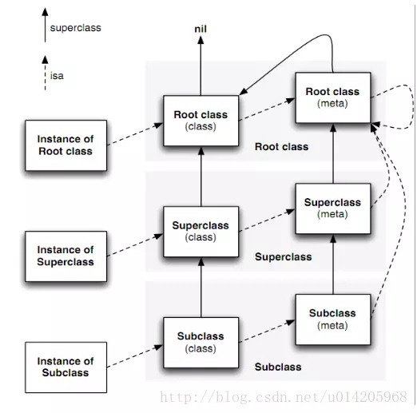

# 宏定义
```
//动态参数配置

#define HLYLog(logFormate,...) [[HLYLog shareInstance] logFormate:logFormate, ## __VA_ARGS__];
//第一个参数为固定参数 从第二个参数开始接受参数
- (void)logFormate:(NSString *)logFormate, ... NS_FORMAT_FUNCTION(1,2);

-------
- (void)logFormate:(NSString *)logFormate, ... NS_FORMAT_FUNCTION(1,2) {
    NSString *logStr;
    va_list argList;
    va_start(argList, logFormate);
    NSString *temp;
    while(temp == va_arg(argList, NSString *)) {
        logStr = [logStr stringByAppendingString:temp];
    }
    va_end(argList);
}
```

#isSubclassOfClass isMemberclassOfClass  isKindOfClass 区别:
* isSubclassOfClass: 是不是这个参数类本身及子类 类方法
* isMemberclassOfClass: 只能是类本身，完全匹配
* isKindOfClass: 参数类本身及子类  对象方法

## isa 

instance、 class object、 metaclass
* instance: 

```
#import "objc/objc.h" 
//an opaque type that represent an Objective-C class,
typedef struct objc_class * Class

//represent an instance if class 
struct objc_object {
    Class isa OBJC_ISA_AVAILABILITY;
}
//a pointer to an instance of a class
typedef struct objc_object *id;

```

* class object / meta class 
类对象中的元数据存储的都是如何创建一个实例的相关信息，类对象的isa指向的是元类(meta class)，元类中保存了创建类对象以及类方法所需的所有信息
NSString *str = @"str"; str的isa指向NSString类对象

获取isa指针指向的对象方法
object_getClass(id obj)
判断class对象是否为元类
class_isMetaClass(Class cls)

```
struct object_class {
    Class isa OBJC_ISA_AVAILABILITY;
    
    Class super_class;
    const char *name;
    long version;
    long info;
    long instance_size;
    struct objc_ivar_list *ivars;
    struct objc_method_list *methodLists;
    struct objc_cache *cache;
    struct objc_protocol_list *protocols;
}
```
 
```
//runtime NSObject源码
+ (Class)class {
    return self;
}
- (Class)class {
    return object_getClass(self);
}

+ (Class)superclass {
    return self->superclass;
}

- (Class)superclass {
    return [self class] -> superclass;
}
```

super 的实现 
objc_msgSendSuper(__rw_objc_super{self,class_getSuperclass(objc_getClass("Student"))}, @selector(run));
也就是传入三个参数，第一个参数是消息的接收者，第二个参数决定了从这个父类对象开始寻找方法的实现，第三个参数就是消息.

经典： init方法中打印
[self class] [super class] [self superclass] [super superclass]
    Son          Son            Person             Person