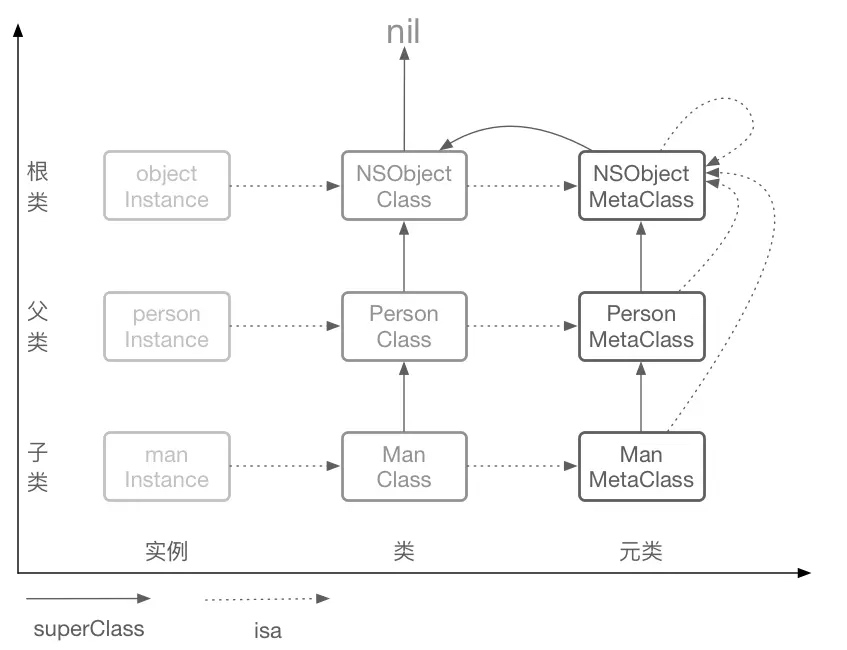
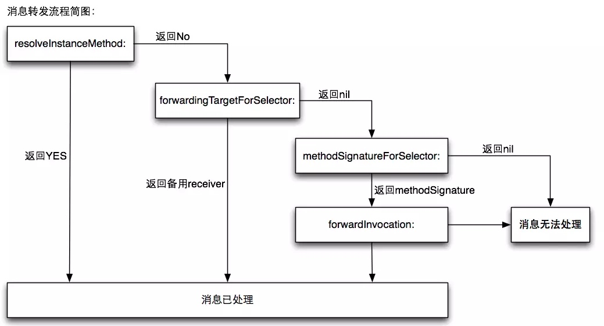

# Runtime 章节

## class object 定义

```
struct objc_class {
    Class isa;
    Class super_class;
    const char *name;
    long version;
    long info;
    long instance_size;
    struct objc_ivar_list *ivars;
    struct objc_method_list *methodLists;
    struct objc_cache *cache;
    struct objc_protocol_list *protocols;
}
typedef struct objc_class *Class;

struct objc_method {
    SEL method_name;
    char *method_types;
    IMP method_imp;
}

struct objc_object {
    Class isa;
}
typedef struct objc_object *id;

```

* 类对象 (objc_class)
    * typedef struct objc_class *Class;
* 实例（objc_object）
    * typedef struct objc_object *id; 
* 元类（meta class）
    * 类对象的isa指针指向 元类 super_class指针指向父类的类对象
    
* Method (objc_method)
    * typedef struct objc_method *method;
* SEL (objc_selector)
    * typedef struct objc_selector *SEL;  区分方法的ID
* IMP (指向最终实现程序的内存地址指针)
    * typedef id(*IMP)(id,SEL,...);
* 类缓存 (objc_cache) 
    * 方法地址缓存
* Category (objc_category)
    * 指向分类的结构体指针
    ```
    struct objc_category {
        const char *name; //class name
        classref_t cls; //要扩展的类对象
        struct method_list_t *instanceMethods;
        struct method_list_t *classMethods;
        struct protocol_list_t *protocols;
        struct property_list_t *instanceProperties;
    }
    ```
    
    
    ## 消息转发
    

    
    ## 作用
    * 关联对象 objc_associated_set
    * Method Swizzling 方法添加、替换、kvo
    * 消息转发
    * 实现nscoding的自动归档和解档
    * 实现字段和模型的自动转化
    
    ```
    //关联对象
objc_setAssociatedObject(self,@selector(get:),value,OBJC_ASSOCIATION_RETAIN_NONATOMIC);
objc_getAssociatedObject(self,@selector(get:));
    ```
    
    ```
    //method swizzling
    + (void)load {
        Class class = [self class];
        SEL originSel = @selector(viewDidLoad:);
        SEL swizzlingSel = @selector(x_viewDidLoad:);
        Method originMethod = class_getInstanceMethod(class, originSel);
        Method swizzlingMethod = class_getInstanceMethod(class, swizzlingSel);
        BOOL addMethod = class_addMethod(class, originSel, method_getImplementation(swizzlingSel), method_getTypeEncoding(swizzlingMethod));
        if (addMethod) {
            class_replaceMethod(class, swizzlingSel, method_getImplementation(originMehtod), method_getTypeEncoding(originMethod));
        }else {
            method_exchangeImplementations(originMethod, swizzlingMethod);
        }
    }
    ```
    * KVO 实现
    
    ```
    动态创建一个对象A的子类，并为这个子类重写了被观察属性keypath的setter方法，被观察对象的isa指针从指向原来的A类，被KVO机制修改为指向系统动态创建的子类NSKVONotifying_A类，来实现当前类属性的监听。
    - (void)setName:(NSString *)name {
        [self willChangeValueForKey:@"name"];
        [super setValue:name forKey:@"name"];
        [self didChangeValueForKey:@"name"];
    }
    ```
    
    ```
    
    -(id)initWithCoder:(NSCoder *)aDecoder {
    if (self = [super init]) {
        unsigned int outCount;
        Ivar * ivars = class_copyIvarList([self class], &outCount);
        for (int i = 0; i < outCount; i ++) {
            Ivar ivar = ivars[i];
            NSString * key = [NSString stringWithUTF8String:ivar_getName(ivar)];
            [self setValue:[aDecoder decodeObjectForKey:key] forKey:key];
        }
    }
    return self;
}
 -(void)encodeWithCoder:(NSCoder *)aCoder {
    unsigned int outCount;
    Ivar * ivars = class_copyIvarList([self class], &outCount);
    for (int i = 0; i < outCount; i ++) {
        Ivar ivar = ivars[i];
        NSString * key = [NSString stringWithUTF8String:ivar_getName(ivar)];
        [aCoder encodeObject:[self valueForKey:key] forKey:key];
    }
}

    ```