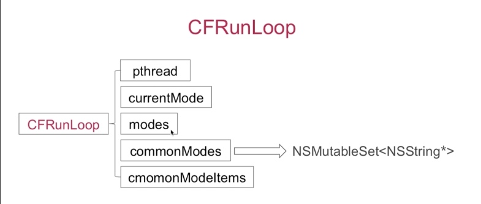
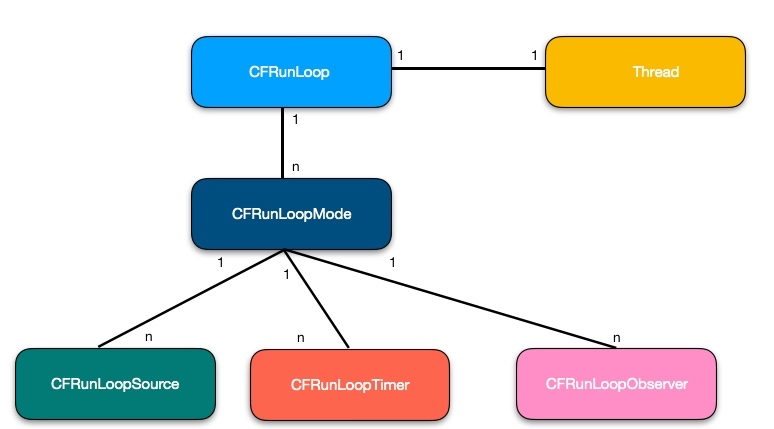
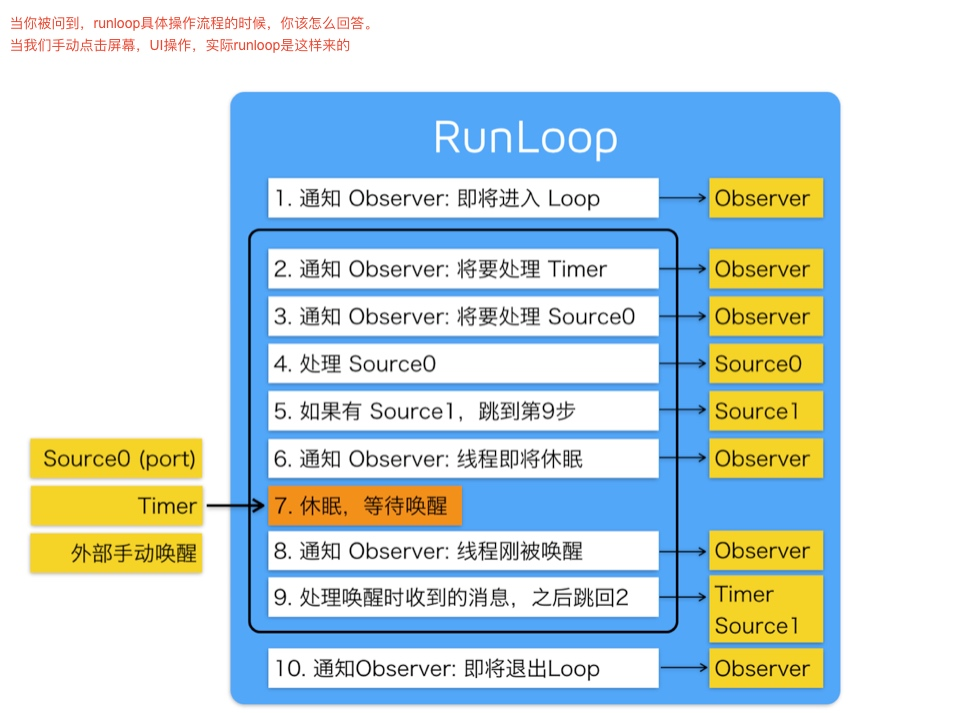
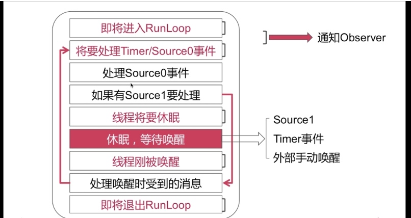
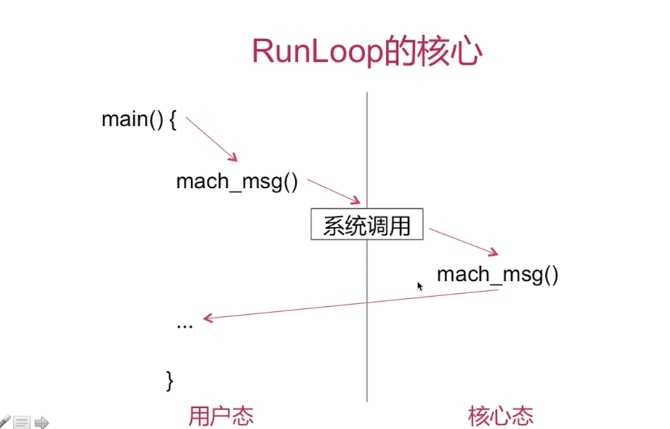
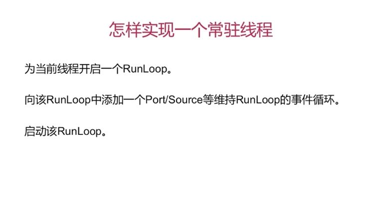

# Runloop 
* 通过内部维护的事件循环来对事件/消息进行管理的一个对象。

## 组成:
* CFRunloopRef 
* CFRunloopModeRef
* CFRunloopSourceRef
* CFRunloopTimerRef
* CFRunloopObserverRef

* pthread  --对应，runloop内一个线程
* currentMode 
    * name mode名
    * source0, source1 都是无序集合
        * source0 : 需要手动唤醒线程 非基于port的 用于用户主动触发的事件：点击按钮、拖拽、手势等事件
        * source1 : 具备唤醒能力 通过内核和其他线程互发消息
    * timers : 数组
    * Observers : CFRunloopObserver观测时间点
        * kCFRunloopEntry  //进入runloop
        * kCFRunloopBeforeTimers   //通知观察者处理timer
        * kCFRunloopBeforeSources //通知观察者处理source
        * kCFRunloopBeforeWaiting //将要休眠 之后就是用户态切换到内核态
        * kCFRunloopAfterWaiting //用户态切换到内核态
        * kCFRunloopExit   //runloop退出
        * kCFRunloopAllActivities //观察所有事件
* modes NSMutableSet<CFRunloopMode *> 集合
* commonModes NSMutableSet<NSString *> 内部每个字符串对应了一种mode
    * kCFRunLoopDefaultMode：App默认mode,通常主线程在这个mode下运行
    * UITrackingRunLoopMode：页面跟踪mode,用于scrollview追踪触摸滑动，保证页面滑动的时候不收其他mode影响
    * UIInitializationRunLoopMode：APP启动时进入的第一个mode，启动完后不再使用
    * GSEventReceiveRunLoopMode：接受系统事件的内部mode,
    * kCFRunLoopCommonModes：这是一个占位用的mode，不是真正的mode
* commonModelItems:里面有多个observer timer source

## 结构关系

> 一个runloop对应了多个mode，每个mode下面又有多种souces timer observer
> 每次runloop启动，只能指定其中的一个mode, ----currentMode
> 如果需要切换mode，只能退出runloop,在重新指定一个mode进入，主要是为了分隔不同mode下的souces timer observer,让其互不影响
> runloop 在同一时间只能处理一种mode下面的事件
#### eg:
* 滑动tableview的时候 timer事件的轮播器不走了 （GCD的定时器不受Runloop的mode影响）
    * timer 的mode 从defauleMode 切换 commonMode
    * 因为commonMode并不是一种实际mode,如果设置了commonmode,那么runloop在切换的时候也把timer 的事件一起带走了，所以无论切换到那种mode，timer都可以处理
    * 默认滚动事件和timer事件都是在kCFRunloopDefaultMode下，滚动的时候mode切换到UITrackingRunloopMode,runloop同一时间只能处理一种mode事件，所以kCFRunloopDefaultMode事件就无法响应了.commonMode 是同步各种mode的方案，当runloop切换到UITrackingRunloopMode，会把timer事件转移到UITrackingRunloopMode下
    * 可以通过GCD定时器来解决 dispatch_queue_t 
    
    ```
    dispathc_queue_t queue = dispatch_get_global_queue(0,0);
    dispatch_source_t timer = dispatch_source_create(DISPATCH_SOURCE_TIMER,0,0,queue);
    dispatch_source_set_timer(timer,DISPATCH_TIME_NOW, 1*NESC_PER_SEC, 0*NSEC_PER_SEC);
    dispatch_source_set_event_handler(timer,^{
        NSLog(".....");
    });
    dispatch_resume(timer); //开启
    dispatch_cancel(timer); //取消
    ```
    



